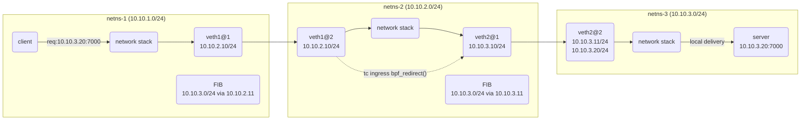

# Ingress Device Redirect

## Topology

By placing a TC ingress program on a network device, packets which are being
received on the device can be redirected to the input queue of another network
device.

When the target network device is in another namespace, you accelerate the packet
delivery by bypassing the ingress device's network stack and deliver the packet
directly to the network stack of the target network device.



The above demonstrates a eBPF redirection.

The solid lines follow a normal packet's flow given a series of interconnected
veths.

In the traditional path, routing tables are used to forward the request to
10.10.3.20 toward the ns-3 namespace.

The eBPF redirect path is shown with dotted lines.

An eBPF redirect can be used to bypass the network stack within the netns-2
network namespace.

This accelerates the packet's delivery and removes potential waiting periods when


## Architecture

In our example topology the emphasis is placed on netns-2.

Netns-1 is used to simulate either the host namespace or an external newtork.

An eBPF redirect is performed with an eBPF helper:
```c
/*
 * bpf_redirect
 *
 * 	Redirect the packet to another net device of index *ifindex*.
 * 	This helper is somewhat similar to **bpf_clone_redirect**\
 * 	(), except that the packet is not cloned, which provides
 * 	increased performance.
 *
 * 	Except for XDP, both ingress and egress interfaces can be used
 * 	for redirection. The **BPF_F_INGRESS** value in *flags* is used
 * 	to make the distinction (ingress path is selected if the flag
 * 	is present, egress path otherwise). Currently, XDP only
 * 	supports redirection to the egress interface, and accepts no
 * 	flag at all.
 *
 * 	The same effect can also be attained with the more generic
 * 	**bpf_redirect_map**\ (), which uses a BPF map to store the
 * 	redirect target instead of providing it directly to the helper.
 *
 * Returns
 * 	For XDP, the helper returns **XDP_REDIRECT** on success or
 * 	**XDP_ABORTED** on error. For other program types, the values
 * 	are **TC_ACT_REDIRECT** on success or **TC_ACT_SHOT** on
 * 	error.
 */
static long (*bpf_redirect)(__u32 ifindex, __u64 flags) = (void *) 23;
```

This helper requires you to provide an interface ID, within the same network
namespace that the eBPF program is running in, to which the SKB is redirected
to.

In our demo program we will run a UDP server in netns-3.
We will store the IP and port this server listens on in an eBPF map along with
the interface ID to which you can route toward netns-3.

When an ingress packet is received on netns-2's veth1@2 interface a TC Ingress
eBPF program will determine if the destination is for the server's IP and
listening port and if it is we'll redirect the packet to veth2@1, the next hop
to get to the server.